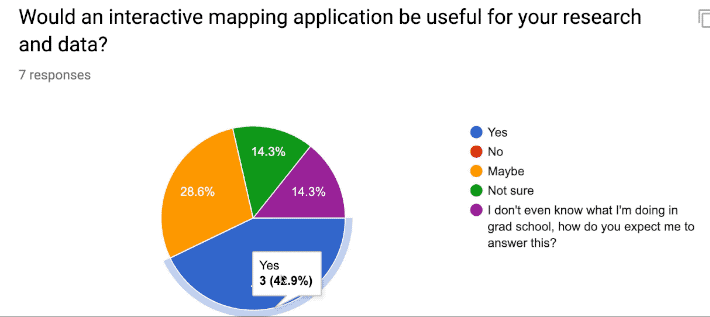
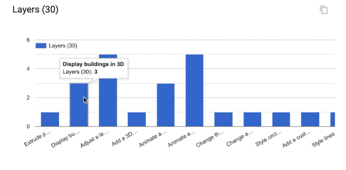
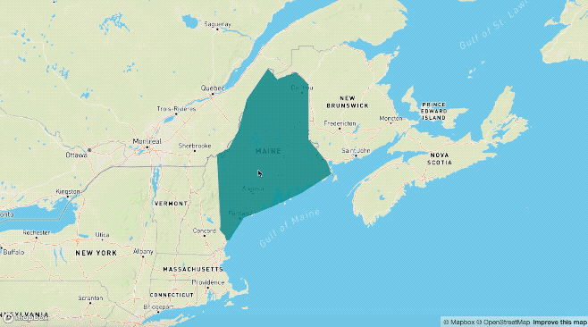
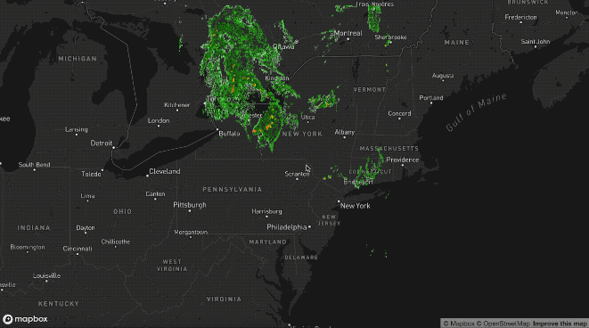

# Mapbox GL - An Interactive Mapping Platform for Geospatial Data

Mapbox provides many tools to build maps into your website or web-based application, including Mapbox GL JS. Mapbox GL JS is an open source JavaScript library you can use to display your Mapbox maps, add interactivity, and customize the map experience in your application.

### Mapbox GL JS
* In active development — new features always being added, improving existing features, and fixing bugs
* Maps are rendered client-side by the browser
* Map data and styles can be changed dynamically

## What You’ll Need
* Mapbox account and access token.
* Mapbox GL JS, a Javascript Library.
* Text Editor, Sublime, Atom, Visual Studio Code, etc. 
* R Studio
* sp data object of choice (in R Studio)
* index.html file representing skeleton of interactive application in Mapbox. I won’t give you all the answers throughout the tutorial, but this will hopefully serve as a decent basis for working from after the lab if desired.

## What Are We Covering & Why Does it Matter?

### Learning **'Goal'**
* Personally useful and relevant, web-based (published to web) interactive mapping application.

### Identified Research Themes
* Solar potential analysis 
* Acoustic impact of vessel noise on natural soundscapes
* Mapping walkability using social media data and GSV imagery
* Optimization of pest inpection
* 3D modeling
* Geostatistical modeling of dissolved oxygen levels
* Scene semantic knowledge
* Dr. Laura Tateosian's funding

### Interest in Interactivity 




## Getting Started

### Git
* Create new repo on Github
  * Example: mapbox-workshop
* Go to the repo settings tab and set the Github Pages source to the master branch:
  * 
* Open terminal/cmd to clone repo to local directory:
  * ```git clone "https://github.com/<'your_user_name_here'>/mapbox-workshop.git"```
  * ```git cd "https://github.com/<'your_user_name_here'>/mapbox-workshop.git"```
* Download (or copy & paste into editor) [index.html](index.html) into the newly created file directory (e.g., mapbox-workshop)<!-- ### The Bones of Mapbox [index.html]: -->
  * It should look like:
```html
<!DOCTYPE html>
<html>
   <head>
      <meta charset='utf-8' />
      <title>Mapbox GL Workshop</title>
      <meta name='viewport' content='initial-scale=1,maximum-scale=1,user-scalable=no' />
      <script src='https://api.tiles.mapbox.com/mapbox-gl-js/v0.53.1/mapbox-gl.js'></script>
      <link href='https://api.tiles.mapbox.com/mapbox-gl-js/v0.53.1/mapbox-gl.css' rel='stylesheet' />
      <style>
         body { margin:0; padding:0; }
         #map { position:absolute; top:0; bottom:0; width:100%; }
      </style>
   </head>
   <body>
      <div id='map'></div>
      <script>
         mapboxgl.accessToken = '<YOUR_TOKEN_KEY_HERE_PLS>'; // don't keep '<' & '>' when pasting token
         
         var map = new mapboxgl.Map({
         container: 'map', // container id
         style: 'mapbox://styles/mapbox/streets-v10', //hosted style id;  
         //others: 
         //	'mapbox://styles/mapbox/light-v10'
         //	'mapbox://styles/mapbox/streets-v10' 
         //	'mapbox://styles/mapbox/dark-v10'
         //	'mapbox://styles/mapbox/outdoors-v10'  
         //	'mapbox://styles/mapbox/satellite-v10' 
         //	'mapbox://styles/mapbox/traffic-night-v2'
         center: [-78.6382, 35.7796], // change starting position to coordinates associated w/ your data.
         zoom: 6 // starting zoom
         });
      </script>
   </body>
</html>
```

### Publishing to Web
* First, open html content in your text editor of choice and do an overall inspection of its structure:
  * What do you recognize?
  * What parameters have been set?
  * Can you understand it?
  * What is it calling on? Where? How?
* **Insert your own token ID**
* Save file
* Now let's see what it looks like on the web with a quick double click:

* Return to your terminal/cmd window
* Check on the directory's status with: ```git status```
* Newly inserted index.html should be shown in red as modified / added content
* Run: 
   * ```git add . ```
   * ```git commit -m "initial commit"```
   * ```git push```


## Understanding Mapbox Features
While we're waiting for our changes to be published online, let's look at a few examples of some useful Mapbox features.
### Map Layers
#### Show & hide layers


#### Adding polygons


#### 3D Buildings

#### Adjust a layer's opacity

#### Animate series of images


### User Interaction
#### Pop up information
#### Create time slider
#### Draggable marker
#### Filter features based on map view
#### Create hover effect

## Making Mapbox Useful
### Data Types
#### Coordinates
#### Raster
#### Vector

#### Show & hide layers
```html
<!DOCTYPE html>
<html>
   <head>
      <meta charset='utf-8' />
      <title>Show and hide layers</title>
      <meta name='viewport' content='initial-scale=1,maximum-scale=1,user-scalable=no' />
      <script src='https://api.tiles.mapbox.com/mapbox-gl-js/v0.53.1/mapbox-gl.js'></script>
      <link href='https://api.tiles.mapbox.com/mapbox-gl-js/v0.53.1/mapbox-gl.css' rel='stylesheet' />
      <style>
         body { margin:0; padding:0; }
         #map { position:absolute; top:0; bottom:0; width:100%; }
      </style>
   </head>
   <body>
      <style>
         #menu {
           background: #fff;
           position: absolute;
           z-index: 1;
           top: 10px;
           right: 10px;
           border-radius: 3px;
           width: 120px;
           border: 1px solid rgba(0,0,0,0.4);
           font-family: 'Open Sans', sans-serif;
         }
         #menu a {
           font-size: 13px;
           color: #404040;
           display: block;
           margin: 0;
           padding: 0;
           padding: 10px;
           text-decoration: none;
           border-bottom: 1px solid rgba(0,0,0,0.25);
           text-align: center;
         }
         #menu a:last-child {
           border: none;
         }
         #menu a:hover {
           background-color: #f8f8f8;
           color: #404040;
         }
         #menu a.active {
           background-color: #3887be;
           color: #ffffff;
         }
         #menu a.active:hover {
           background: #3074a4;
         }
      </style>
      <nav id="menu"></nav>
      <div id="map"></div>
      <script>
         mapboxgl.accessToken = '<YOUR_TOKEN_KEY_HERE_PLS>';
         var map = new mapboxgl.Map({
         container: 'map',
         style: 'mapbox://styles/mapbox/streets-v11',
         zoom: 15,
         center: [-71.97722138410576, -13.517379300798098]
         });
          
         map.on('load', function () {
         map.addSource('museums', {
           type: 'vector',
           url: 'mapbox://mapbox.2opop9hr'
         });
         map.addLayer({
           'id': 'museums',
           'type': 'circle',
           'source': 'museums',
           'layout': {
           'visibility': 'visible'
         },
           'paint': {
             'circle-radius': 8,
             'circle-color': 'rgba(55,148,179,1)'
         },
         'source-layer': 'museum-cusco'
         });
          
         map.addSource('contours', {
           type: 'vector',
           url: 'mapbox://mapbox.mapbox-terrain-v2'
         });
         map.addLayer({
           'id': 'contours',
           'type': 'line',
           'source': 'contours',
           'source-layer': 'contour',
           'layout': {
             'visibility': 'visible',
             'line-join': 'round',
             'line-cap': 'round'
           },
           'paint': {
             'line-color': '#877b59',
             'line-width': 1
         }
         });
         });
          
         var toggleableLayerIds = [ 'contours', 'museums' ];
          
         for (var i = 0; i < toggleableLayerIds.length; i++) {
         var id = toggleableLayerIds[i];
          
         var link = document.createElement('a');
           link.href = '#';
           link.className = 'active';
           link.textContent = id;
          
         link.onclick = function (e) {
           var clickedLayer = this.textContent;
           e.preventDefault();
           e.stopPropagation();
          
         var visibility = map.getLayoutProperty(clickedLayer, 'visibility');
          
         if (visibility === 'visible') {
           map.setLayoutProperty(clickedLayer, 'visibility', 'none');
           this.className = '';
           } else {
           this.className = 'active';
           map.setLayoutProperty(clickedLayer, 'visibility', 'visible');
           }
         };
          
         var layers = document.getElementById('menu');
           layers.appendChild(link);
         }
          
      </script>
   </body>
</html>
```
#### Adding polygons
#### 3D Buildings
#### Adjust a layer's opacity
#### Animate series of images

### Data Types
#### Coordinates
#### Raster
#### Vector

### User Interaction
#### Pop up information
#### Create time slider
#### Draggable marker
#### Filter features based on map view
#### Create hover effect